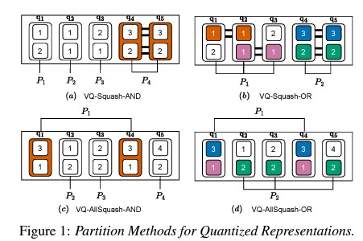

## Introduction
This code repository is the official implementation of the [Unsupervised Speech Representation Pooling Using Vector Quantization](https://arxiv.org/abs/2304.03940).
We design a novel pooling method to squash acoustically similar representations via vector quantization.



The observed t-distributed Stochastic Neighbor Embedding (t-SNE) figure demonstrates the effectiveness of VQ-based pooling approaches in capturing the temporal importance of speech representations.


Additionally, we visualize a sample speech and its pooling weights induced by our VQ-LP method.


### Getting start
To reproduce the experiments in this paper, perform the following three steps:
1. Download the dataset
2. Perform feature extraction
3. Unsupervised benchmark
4. Supervised Learning benchmark

Our benchmark performance is as follows.


### 1. Download the dataset
We do not provide a guide for downloading the datasets here, but only provide the links. It is recommended to download the following four datasets into the `data` directory.
- [Google SpeechCommands dataset V2](https://www.tensorflow.org/datasets/catalog/speech_commands?hl=en)
- [VoxCeleb1](https://www.robots.ox.ac.uk/~vgg/data/voxceleb/)
- [fluent speech cojmmand dataset](https://fluent.ai/fluent-speech-commands-a-dataset-for-spoken-language-understanding-research/)
- [IEMOCAP](https://sail.usc.edu/iemocap/)


### 2. feature extraction
Our naming convention is as follows. The term "mean" refers to the average of the representations from each transformer block. And "VQ" means the quantized representations, denoted as "**Q**", using vector quantizer module.

| | wav2vec2.0-base | wav2vec2.0-large | XLS-R |
|---------|---------|----------|----------|
|mean| _mean | _mean | _mean | 
|VQ | _VQ | _VQ | _VQ |

#### KWS
- wav2vec2.0-base mean
```
# training
python pre_extract_feats.py --data_name speechcommands --root data --url speech_commands_v0.02 --subset training --tag _wav2vec2_base_mean --ext_type wav2vec2 --method mean
# validation
python pre_extract_feats.py --data_name speechcommands --root data --url speech_commands_v0.02 --subset validation --tag _wav2vec2_base_mean --ext_type wav2vec2 --method mean
# testing
python pre_extract_feats.py --data_name speechcommands --root data --url speech_commands_v0.02 --subset testing --tag _wav2vec2_base_mean --ext_type wav2vec2 --method mean
```
- wav2vec2.0-base VQ
```
# training
python pre_extract_feats.py --data_name speechcommands --root data --url speech_commands_v0.02 --subset training --tag _wav2vec2_base_vq --ext_type VQWav2VecExtractor --method vq
#validation
python pre_extract_feats.py --data_name speechcommands --root data --url speech_commands_v0.02 --subset validation --tag _wav2vec2_base_vq --ext_type VQWav2VecExtractor --method vq
# testing
python pre_extract_feats.py --data_name speechcommands --root data --url speech_commands_v0.02 --subset testing --tag _wav2vec2_base_vq --ext_type VQWav2VecExtractor --method vq

```
- wav2vec2.0-large mean
```
# training
python pre_extract_feats.py --data_name speechcommands --root data --url speech_commands_v0.02 --subset training --tag _wav2vec2_large_mean --ext_type Wav2VeLargeExtractor --method mean
# validation
python pre_extract_feats.py --data_name speechcommands --root data --url speech_commands_v0.02 --subset validation --tag _wav2vec2_large_mean --ext_type Wav2VeLargeExtractor --method mean
# testing
python pre_extract_feats.py --data_name speechcommands --root data --url speech_commands_v0.02 --subset testing --tag _wav2vec2_large_mean --ext_type Wav2VeLargeExtractor --method mean
```
- wav2vec2.0-large VQ
```
# training
python pre_extract_feats.py --data_name speechcommands --root data --url speech_commands_v0.02 --subset training --tag _wav2vec2_large_vq --ext_type VQWav2VeLargeExtractor --method vq
# validation
python pre_extract_feats.py --data_name speechcommands --root data --url speech_commands_v0.02 --subset validation --tag _wav2vec2_large_vq --ext_type VQWav2VeLargeExtractor --method vq
# testing
python pre_extract_feats.py --data_name speechcommands --root data --url speech_commands_v0.02 --subset testing --tag _wav2vec2_large_vq --ext_type VQWav2VeLargeExtractor --method vq
```
- XLS-R mean
```
# training
python pre_extract_feats.py --data_name speechcommands --root data --url speech_commands_v0.02 --subset training --tag _xlsr_mean --ext_type Wav2VecXLSR03BExtractor --method mean
# validation
python pre_extract_feats.py --data_name speechcommands --root data --url speech_commands_v0.02 --subset validation --tag _xlsr_mean --ext_type Wav2VecXLSR03BExtractor --method mean
# testing
python pre_extract_feats.py --data_name speechcommands --root data --url speech_commands_v0.02 --subset testing --tag _xlsr_mean --ext_type Wav2VecXLSR03BExtractor --method mean
```
- XLS-R VQ
```
# training
python pre_extract_feats.py --data_name speechcommands --root data --url speech_commands_v0.02 --subset training --tag _xlsr_vq --ext_type VQWav2VecXLSR03BExtractor --method vq
# validation
python pre_extract_feats.py --data_name speechcommands --root data --url speech_commands_v0.02 --subset validation --tag _xlsr_vq --ext_type VQWav2VecXLSR03BExtractor --method vq
# testing
python pre_extract_feats.py --data_name speechcommands --root data --url speech_commands_v0.02 --subset testing --tag _xlsr_vq --ext_type VQWav2VecXLSR03BExtractor --method vq
```

#### SI
- wav2vec2.0-base mean
```
# training
python pre_extract_feats.py --data_name voxceleb --root data/voxceleb1 --new_root data/voxceleb1 --url iden_split.txt --subset training --tag _wav2vec2_base_mean --ext_type wav2vec2 --method mean
# validation
python pre_extract_feats.py --data_name voxceleb --root data/voxceleb1 --new_root data/voxceleb1 --url iden_split.txt --subset validation --tag _wav2vec2_base_mean --ext_type wav2vec2 --method mean
# testing
python pre_extract_feats.py --data_name voxceleb --root data/voxceleb1 --new_root data/voxceleb1 --url iden_split.txt --subset testing --tag _wav2vec2_base_mean --ext_type wav2vec2 --method mean
```
- wav2vec2.0-base VQ
```
# training
python pre_extract_feats.py --data_name voxceleb --root data/voxceleb1 --new_root data/voxceleb1 --url iden_split.txt --subset training --tag _wav2vec2_base_vq --ext_type VQWav2VecExtractor --method vq
# validation
python pre_extract_feats.py --data_name voxceleb --root data/voxceleb1 --new_root data/voxceleb1 --url iden_split.txt --subset validation --tag _wav2vec2_base_vq --ext_type VQWav2VecExtractor --method vq
# testing
python pre_extract_feats.py --data_name voxceleb --root data/voxceleb1 --new_root data/voxceleb1 --url iden_split.txt --subset testing --tag _wav2vec2_base_vq --ext_type VQWav2VecExtractor --method vq
```
- wav2vec2.0-large mean
```
# training
python pre_extract_feats.py --data_name voxceleb --root data/voxceleb1 --new_root data/voxceleb1 --url iden_split.txt --subset training --tag _wav2vec2_large_mean --ext_type Wav2VeLargeExtractor --method mean
# validation
python pre_extract_feats.py --data_name voxceleb --root data/voxceleb1 --new_root data/voxceleb1 --url iden_split.txt --subset validation --tag _wav2vec2_large_mean --ext_type Wav2VeLargeExtractor --method mean
# testing
python pre_extract_feats.py --data_name voxceleb --root data/voxceleb1 --new_root data/voxceleb1 --url iden_split.txt --subset testing --tag _wav2vec2_large_mean --ext_type Wav2VeLargeExtractor --method mean
```
- wav2vec2.0-large VQ
```
# training
python pre_extract_feats.py --data_name voxceleb --root data/voxceleb1 --new_root data/voxceleb1 --url iden_split.txt --subset training --tag _wav2vec2_large_vq --ext_type VQWav2VeLargeExtractor --method vq
# validation
python pre_extract_feats.py --data_name voxceleb --root data/voxceleb1 --new_root data/voxceleb1 --url iden_split.txt --subset validation --tag _wav2vec2_large_vq --ext_type VQWav2VeLargeExtractor --method vq
# testing
python pre_extract_feats.py --data_name voxceleb --root data/voxceleb1 --new_root data/voxceleb1 --url iden_split.txt --subset testing --tag _wav2vec2_large_vq --ext_type VQWav2VeLargeExtractor --method vq
```
- XLS-R mean
```
# training
python pre_extract_feats.py --data_name voxceleb --root data/voxceleb1 --new_root data/voxceleb1 --url iden_split.txt --subset training --tag _xlsr_mean --ext_type Wav2VecXLSR03BExtractor --method mean
# validation
python pre_extract_feats.py --data_name voxceleb --root data/voxceleb1 --new_root data/voxceleb1 --url iden_split.txt --subset validation --tag _xlsr_mean --ext_type Wav2VecXLSR03BExtractor --method mean
# testing
python pre_extract_feats.py --data_name voxceleb --root data/voxceleb1 --new_root data/voxceleb1 --url iden_split.txt --subset testing --tag _xlsr_mean --ext_type wav2vec2 --Wav2VecXLSR03BExtractor mean
```
- XLS-R VQ
```
# training
python pre_extract_feats.py --data_name voxceleb --root data/voxceleb1 --new_root data/voxceleb1 --url iden_split.txt --subset training --tag _xlsr_vq --ext_type VQWav2VecXLSR03BExtractor --method vq
# validation
python pre_extract_feats.py --data_name voxceleb --root data/voxceleb1 --new_root data/voxceleb1 --url iden_split.txt --subset validation --tag _xlsr_vq --ext_type VQWav2VecXLSR03BExtractor --method vq
# testing
python pre_extract_feats.py --data_name voxceleb --root data/voxceleb1 --new_root data/voxceleb1 --url iden_split.txt --subset testing --tag _xlsr_vq --ext_type VQWav2VecXLSR03BExtractor --method vq
```

### IC
- wav2vec2.0-base mean
```
# training
python pre_extract_feats.py --data_name fluent --root data/fluent_speech_commands_dataset --new_root data/fluent_speech_commands_dataset --subset training --tag _wav2vec2_base_mean --ext_type wav2vec2 --method mean
# validation
python pre_extract_feats.py --data_name fluent --root data/fluent_speech_commands_dataset --new_root data/fluent_speech_commands_dataset --subset validation --tag _wav2vec2_base_mean --ext_type wav2vec2 --method mean
# testing
python pre_extract_feats.py --data_name fluent --root data/fluent_speech_commands_dataset --new_root data/fluent_speech_commands_dataset --subset testing --tag _wav2vec2_base_mean --ext_type wav2vec2 --method mean
```

- wav2vec2.0-base VQ
```
# training
python pre_extract_feats.py --data_name fluent --root data/fluent_speech_commands_dataset --new_root data/fluent_speech_commands_dataset --subset training --tag _wav2vec2_base_vq --ext_type VQWav2VecExtractor --method vq
# validation
python pre_extract_feats.py --data_name fluent --root data/fluent_speech_commands_dataset --new_root data/fluent_speech_commands_dataset --subset validation --tag _wav2vec2_base_vq --ext_type VQWav2VecExtractor --method vq
# testing
python pre_extract_feats.py --data_name fluent --root data/fluent_speech_commands_dataset --new_root data/fluent_speech_commands_dataset --subset testing --tag _wav2vec2_base_vq --ext_type VQWav2VecExtractor --method vq
```

- wav2vec2.0-large mean
```
# training
python pre_extract_feats.py --data_name fluent --root data/fluent_speech_commands_dataset --new_root data/fluent_speech_commands_dataset --subset training --tag _wav2vec2_large_mean --ext_type Wav2VeLargeExtractor --method mean
# validation
python pre_extract_feats.py --data_name fluent --root data/fluent_speech_commands_dataset --new_root data/fluent_speech_commands_dataset --subset validation --tag _wav2vec2_large_mean --ext_type Wav2VeLargeExtractor --method mean
# testing
python pre_extract_feats.py --data_name fluent --root data/fluent_speech_commands_dataset --new_root data/fluent_speech_commands_dataset --subset testing --tag _wav2vec2_large_mean --ext_type Wav2VeLargeExtractor --method mean
```

- wav2vec2.0-large VQ
```
# training
python pre_extract_feats.py --data_name fluent --root data/fluent_speech_commands_dataset --new_root data/fluent_speech_commands_dataset --subset training --tag _wav2vec2_large_vq --ext_type VQWav2VeLargeExtractor --method vq
# validation
python pre_extract_feats.py --data_name fluent --root data/fluent_speech_commands_dataset --new_root data/fluent_speech_commands_dataset --subset validation --tag _wav2vec2_large_vq --ext_type VQWav2VeLargeExtractor --method vq
# testing
python pre_extract_feats.py --data_name fluent --root data/fluent_speech_commands_dataset --new_root data/fluent_speech_commands_dataset --subset testing --tag _wav2vec2_large_vq --ext_type VQWav2VeLargeExtractor --method vq
```

- XLS-R mean
```
# training
python pre_extract_feats.py --data_name fluent --root data/fluent_speech_commands_dataset --new_root data/fluent_speech_commands_dataset --subset training --tag _xlsr_mean --ext_type Wav2VecXLSR03BExtractor --method mean
# validation
python pre_extract_feats.py --data_name fluent --root data/fluent_speech_commands_dataset --new_root data/fluent_speech_commands_dataset --subset validation --tag _xlsr_mean --ext_type Wav2VecXLSR03BExtractor --method mean
# testing
python pre_extract_feats.py --data_name fluent --root data/fluent_speech_commands_dataset --new_root data/fluent_speech_commands_dataset --subset testing --tag _xlsr_mean --ext_type Wav2VecXLSR03BExtractor --method mean
```

- XLS-R VQ
```
# training
python pre_extract_feats.py --data_name fluent --root data/fluent_speech_commands_dataset --new_root data/fluent_speech_commands_dataset --subset training --tag _xlsr_vq --ext_type VQWav2VecXLSR03BExtractor --method vq
# validation
python pre_extract_feats.py --data_name fluent --root data/fluent_speech_commands_dataset --new_root data/fluent_speech_commands_dataset --subset validation --tag _xlsr_vq --ext_type VQWav2VecXLSR03BExtractor --method vq
# testing
python pre_extract_feats.py --data_name fluent --root data/fluent_speech_commands_dataset --new_root data/fluent_speech_commands_dataset --subset testing --tag _xlsr_vq --ext_type VQWav2VecXLSR03BExtractor --method vq
```

### ER
- wav2vec2.0-base mean
```
python pre_extract_feats.py --data_name iemocap --root data --new_root data/IEMOCAP --tag _wav2vec2_base_mean --ext_type wav2vec2 --method mean
```
- wav2vec2.0-base VQ
```
python pre_extract_feats.py --data_name iemocap --root data --new_root data/IEMOCAP --tag _wav2vec2_base_vq --ext_type VQWav2VecExtractor --method vq
```

- wav2vec2.0-large mean
```
python pre_extract_feats.py --data_name iemocap --root data --new_root data/IEMOCAP --tag _wav2vec2_large_mean --ext_type Wav2VeLargeExtractor --method mean
```

- wav2vec2.0-large VQ
```
python pre_extract_feats.py --data_name iemocap --root data --new_root data/IEMOCAP --tag _wav2vec2_large_vq --ext_type VQWav2VeLargeExtractor --method vq
```

- XLS-R mean
```
python pre_extract_feats.py --data_name iemocap --root data --new_root data/IEMOCAP --tag _xlsr_mean --ext_type Wav2VecXLSR03BExtractor --method mean
```

- XLS-R VQ
```
python pre_extract_feats.py --data_name iemocap --root data --new_root data/IEMOCAP --tag _xlsr_vq --ext_type VQWav2VecXLSR03BExtractor --method vq
```

### Unsupervised Benchmark
- wav2vec2.0 - base
```
CUDA_VISIBLE_DEVICES=0 python run_unsupervised.py --dir results/unsupervised --upstream wav2vec2_base --tail mean --vq_tail vq --mode both
```


### Supervised Benchmark
```
CUDA_VISIBLE_DEVICES=0 python main.py --config ./configs/esc_50.yaml --mode test
```
